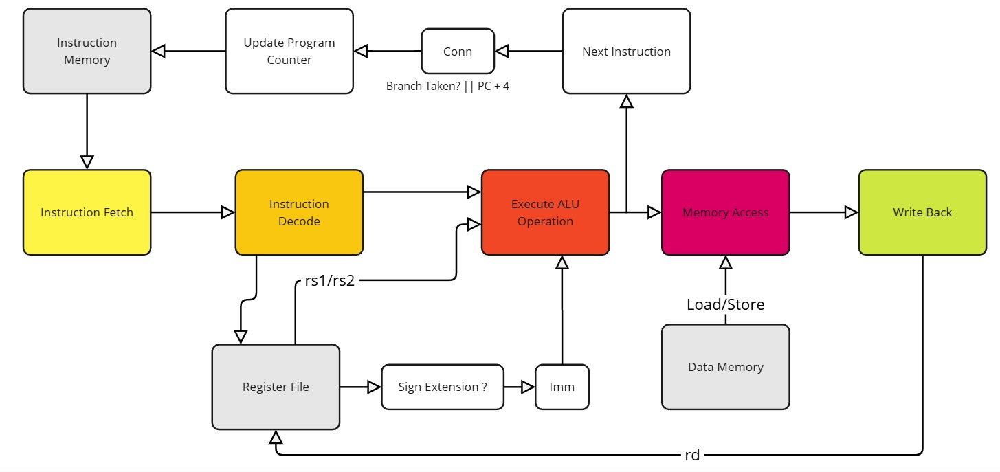

# 🖥️ Riscv Pipeline Core
### Implementation of a simple unpipelined RISC V core for ECE 571 (Intro to SystemVerilog)
### Fall 2024
  



### Cloning the project
```bash
git clone <git@github.com:reecewayt/riscv-pipeline-core.git>
```
  
# 🚀 RISCV Pipeline Core Build System
- Please note that our build system uses `Makefile` and also has the following dependencies
## 📋 Dependencies

| Tool | Description | Availability |
|------|-------------|--------------|
| `QuestaSim` | RTL Simulation Tool Suite | Licensed Product |
| `vsim` | Simulator | Part of QuestaSim |
| `vlog` | Verilog/SystemVerilog Compiler | Part of QuestaSim |
| `vlib` | Library Management Tool | Part of QuestaSim |

> ⚠️ **Important**: This build system requires access to Siemens QuestaSim/ModelSim tools. These are licensed products typically available through academic institutions or commercial licenses.

### 🔍 Verifying Tool Installation
```bash
# Check if QuestaSim tools are available
which vsim vlog vlib

# Check QuestaSim version
vsim -version
```
## 💡Running and simulating the processor core
```bash
# Run from root directory
make simulate
```
## 🎯 Main Targets

| Command | Description |
|---------|-------------|
| `compile` | Compile the RISCV core and top-level testbench |
| `simulate` | Run the top-level simulation |
| `regression` | Run all unit tests |
| `clean` | Clean all build artifacts |
| `help` | Show this help message |

## ⚙️ Options

| Option | Description |
|--------|-------------|
| `GUI=1` | Run simulation in GUI mode |
| `WAVES=1` | Enable waveform logging |

## 💡 Examples

```bash
# Run top-level simulation in command-line mode
make simulate

# Run with GUI and waveforms
make simulate GUI=1 WAVES=1

# Run all unit tests
make regression
```
## 🔍 Default Values

- GUI mode: Disabled by default (`GUI=0`)
- Waveform logging: Disabled by default (`WAVES=0`)
- Default target: `help`

## 🚨 Important Notes

- Always run from the project root directory
- Check compilation output for warnings and errors
- Use `clean` before rebuilding if you encounter issues
- Running an individual unit test is a matter of navigating to the test in question, then run `make`
```bash
# Example
cd tb/tests/decode/
make
```

## 🔧 Directory Structure

```
riscv-pipeline-core/
├── rtl/                # RTL source files
├── tb/                 # Testbench files
└── docs/               # Documentation
```
